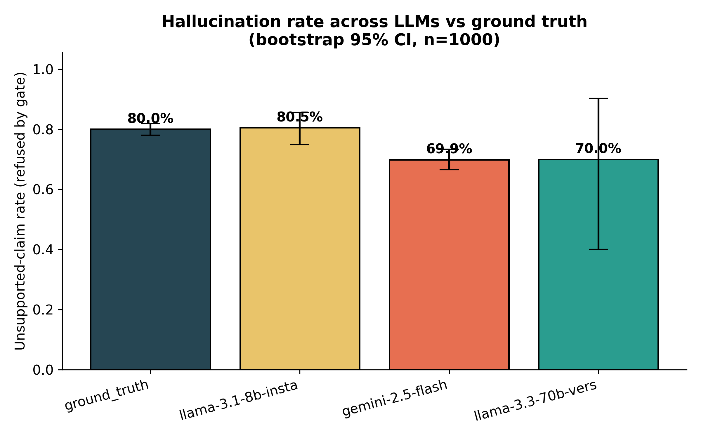
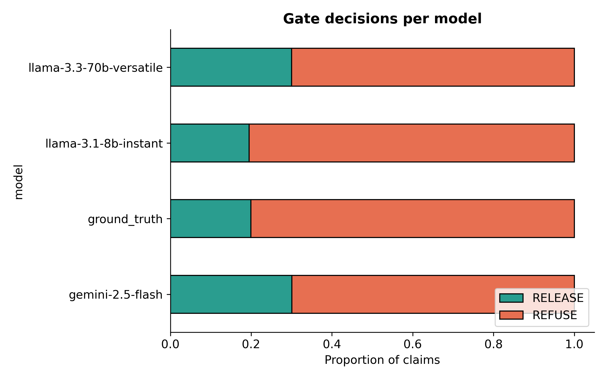
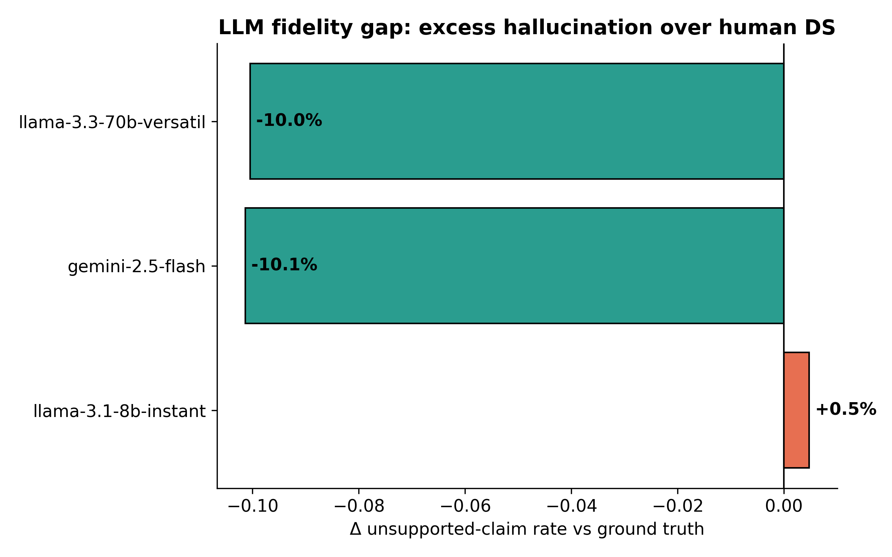

# Safe Discharge Summary

A claim-level verification harness for LLM-generated discharge summaries.

This project is **not** primarily a better summarizer. It is a **measurement and governance layer** that audits each atomic claim in a generated discharge summary and decides whether to:

- **RELEASE** the claim with supporting evidence, or
- **REFUSE** the claim with a structured reason code.

Every decision is logged in a reproducible audit trail, turning model outputs into an inspectable safety dataset.

## Why this project matters

LLM discharge summaries are useful only if each claim can be justified against source clinical notes. This repository builds a **proof-carrying audit workflow** in which every claim ships with either:

1. a citation-backed release decision, or  
2. a refusal reason such as:
   - **contradiction**
   - **low confidence**
   - **no evidence**

This makes the system suitable for:
- hallucination measurement
- model benchmarking
- clinical governance
- future learning from refusal logs

## Core ideas

- **Claim-level verification:** each summary is decomposed into atomic claims.
- **NLI-based governance gate:** entailment and contradiction scores determine release vs refusal.
- **Proof-carrying logs:** each decision is written to structured JSONL for reproducibility.
- **Cross-model benchmark:** multiple LLMs are evaluated under the same harness.
- **Fidelity gap metric:** compares audited LLM behavior against the human ground-truth discharge summary.

## Current benchmark framing

The current setup compares discharge-summary generation and audit outcomes across:
- **Llama-3.3-70B**
- **Llama-3.1-8B**
- **Gemini-2.5-Flash**
- **Human ground-truth discharge summary** as a practical ceiling baseline

The current cohort is organized into five surgical domains:
- cardiac
- orthopaedic
- vascular
- neuro
- abdominal

## Select figures

### 1. Hallucination / refusal profile across models
This is the headline comparison showing how often each model produces claims that the governance gate refuses.



### 2. Decision breakdown of the governance gate
This figure shows how claims are distributed across release and refusal categories, making the error taxonomy clinically interpretable.



### 3. LLM vs ground-truth fidelity comparison
This figure highlights the **fidelity gap** between audited LLM outputs and the human-authored discharge summary baseline.



## File-type composition
 
| Category | Count | Percentage |
|---|---:|---:|
| Python source | 10 | 47.6% |
| Figures / media | 6 | 28.6% |
| Documentation | 2 | 9.5% |
| Other | 2 | 9.5% |
| Text / misc | 1 | 4.8% |

## Repository structure

```text
safe-discharge-summary/
├── README.md
├── requirements.txt
├── .gitignore
├── configs/
├── notebooks/
├── results/
│   └── figures/
│       ├── 01_hallucination_by_model.png
│       ├── 02_decision_breakdown.png
│       ├── 03_refusal_reasons.png
│       ├── 04_entailment_distribution.png
│       ├── 05_contradiction_catch.png
│       └── 06_llm_vs_groundtruth.png
├── src/
│   ├── __init__.py
│   ├── audit_v2.py
│   ├── bq_cohort.py
│   ├── bq_mimic_probe.py
│   ├── bq_smoketest.py
│   ├── cohort.py
│   ├── cohort_v2.py
│   ├── ds_audit.py
│   ├── llm_generate.py
│   └── plots_v2.py
└── tests/

